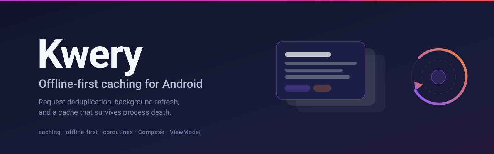
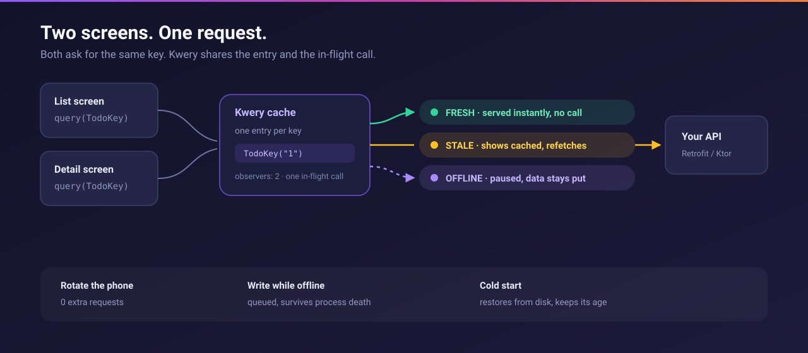

# Kwery



[](https://jitpack.io/#dbjpanda/kwery)
[](https://github.com/dbjpanda/kwery/actions/workflows/ci.yml)
[](LICENSE)

**Offline-first caching for Android.** Your screens ask for data. Kwery decides
what to serve, what to refresh, and what to queue until the network returns.

Built on coroutines and Flow. Works from a ViewModel or from Compose.

## Is Kwery another HTTP client?

**No.** You keep Retrofit, Ktor or OkHttp. Kwery sits on top of whichever one
you already use.

```
your screen  ──►  Kwery  ──►  Retrofit / Ktor / OkHttp  ──►  your server
                    │
                    └── decides whether to call the network at all,
                        what to show while it does, and what to keep
```

If you know the web: **Retrofit is `fetch`. Kwery is TanStack Query.** You use
both, and they do different jobs.

Kwery never opens a connection. You hand it a function that fetches, and it
decides when to run that function, who shares the result, what the screen shows
while it runs, and what happens when it fails.

```kotlin
// Kwery handles caching, loading state, dedup, retries and offline.
val state = rememberQuery(TodoKey(id)) {
    api.todo(id)        // your existing Retrofit or Ktor call, unchanged
}
```

## What problem does it actually solve?

Here is a normal screen that loads a list. No library, just coroutines:

```kotlin
class TodoViewModel(private val api: Api) : ViewModel() {
    private val _state = MutableStateFlow(UiState())
    val state = _state.asStateFlow()
    private var job: Job? = null

    fun load() {
        job?.cancel()
        job = viewModelScope.launch {
            _state.update { it.copy(isLoading = true, error = null) }
            try {
                _state.update { it.copy(isLoading = false, todos = api.todos()) }
            } catch (e: Exception) {
                _state.update { it.copy(isLoading = false, error = e) }
            }
        }
    }
}
```

Most Android apps contain some version of this, once per screen. It works, and
it still has all of these problems:

- **Rotate the phone** and it fetches again, even though the data arrived a
  second ago.
- **Two screens showing the same list** make two identical requests at the same
  moment.
- **Reopen the app** after Android kills it and the user gets a blank screen and
  a spinner, every time.
- **Save something with no signal** and the write is simply lost.
- **Pull to refresh** and you cannot tell "loading for the first time" from
  "refreshing what is already on screen", so the whole list flashes a spinner.
- Retry, backoff, and "stop polling when the app is in the background" are all
  still yours to write.

The same screen with Kwery:

```kotlin
val todos = client.query(TodoListKey) { api.todos() }
```

Every item above is handled. Not because the library is clever, but because
these are the same six problems in every app, and they have known answers.

## What you would otherwise write by hand

| What the user notices | What it takes to fix yourself |
|---|---|
| Rotation refetches | keep a cache outside the ViewModel, track what is in flight |
| Two screens, two requests | a registry of in-flight calls keyed by request |
| Spinner on every cold start | a disk cache, plus deciding what is too old to show |
| Lost write when offline | a durable queue, replay on reconnect, idempotency keys |
| Full-screen spinner on refresh | two separate status flags, not one enum |
| Refetch storms on reconnect | debounce, and knowing the network is *really* back |

## Do you need it?

**Probably yes if** your app reads data from a server on more than one screen,
or the same data appears in more than one place, or users use it on a train.

**Probably not if** your app fetches once at startup and never again, or all
your data is local.

## Install

```kotlin
implementation("io.github.dbjpanda:kwery-core:0.3.2")
implementation("io.github.dbjpanda:kwery-android:0.3.2")        // focus + connectivity
implementation("io.github.dbjpanda:kwery-compose:0.3.2")        // rememberQuery
implementation("io.github.dbjpanda:kwery-persist:0.3.2")        // cache across process death
implementation("io.github.dbjpanda:kwery-persist-room:0.3.2")   // Room store for large caches
testImplementation("io.github.dbjpanda:kwery-test:0.3.2")       // TestQueryClient
```

On Maven Central. No extra repository needed.

## How it works



## Use it

Declare a key. Ask for data. That is the whole API.

```kotlin
data class TodoKey(val id: String) : QueryKey<Todo> {
    override val parts get() = listOf("todo", id)
}

@Composable
fun TodoScreen(id: String) {
    val state = rememberQuery(TodoKey(id)) { api.todo(id) }

    when {
        state.isLoading -> Spinner()
        state.isError   -> ErrorView(state.error!!)
        else            -> TodoView(state.data!!, refreshing = state.isRefreshing)
    }
}
```

Same cache from a ViewModel:

```kotlin
val todos = client.query(TodoListKey) { api.todos() }
    .stateIn(viewModelScope, WhileSubscribed(5_000), QueryState())
```

Compose is a thin layer over the Flow core. Both surfaces share one entry and
one in-flight request.

## Why not roll your own

Most apps hand-roll this in a repository class. It works until the third screen
wants the same data, or the phone rotates mid-request, or someone taps save on
the Tube.

Kwery handles the Android cases that are easy to get wrong:

| Situation | What happens |
|---|---|
| Two screens, same key | One request, shared state |
| Rotate the phone | Zero extra requests |
| Return to the app | Refetch only if stale |
| Captive portal wifi | Treated as offline, not a failure |
| No network | Query pauses, keeps data on screen |
| Write while offline | Queued, replayed after process death |
| Long session | Cache bounded by size, not just time |

Each row is backed by a test. The rotation one is why the grace window exists:
without it, the default `staleTime` of zero fires a fresh request every time the
device turns.

## Two status axes

Most libraries use one enum. That loses the two states Android hits most.

```kotlin
state.isRefreshing   // success + fetching: new data on the way, old data on screen
state.isPaused       // pending + paused: offline, will resume by itself
```

`status` says what you have. `fetchStatus` says what is happening. Keeping them
apart is what makes a background refresh different from a cold start.

## Testing

`TestQueryClient` gives you a virtual clock and request counting. Kwery's own
suite is built on it, and nothing in it calls a real `delay()`, so 398 tests run
in seconds.

```kotlin
@Test fun `deduplicates`() = runTest {
    val kwery = TestQueryClient(this)

    repeat(10) {
        backgroundScope.launch { kwery.query(TodoKey("1")) { api.todo() }.collect { } }
    }
    kwery.awaitIdle()

    assertEquals(1, kwery.requestCount)   // ten screens, one request
}
```

## Compared to

Inspired by [TanStack Query](https://tanstack.com/query/latest), rebuilt for how
Android behaves: process death, rotation, captive-portal wifi, and a process
that lives for days.

|  | Kwery | [Soil](https://github.com/soil-kt/soil) | [Store5](https://github.com/MobileNativeFoundation/Store) |
|---|---|---|---|
| Works in a ViewModel | yes | Compose only | yes |
| Ad-hoc `query(key)` | yes | yes | stores declared up front |
| Cache survives process death | built in | no | via `SourceOfTruth` |
| Offline write queue | yes | no | partial |
| Virtual-clock test client | yes | no | no |

## Docs

[Start here](docs/README.md). 23 pages, every code example checked against the
published API on each build.

Popular ones: [queries](docs/queries.md), [caching](docs/caching.md),
[mutations](docs/mutations.md), [offline](docs/offline.md),
[testing](docs/testing.md).

## Status

Version 0.3.2. Early but real: 22 of 24 planned features are specified, tested
and documented. What is left needs a physical device.
[RELEASE.md](RELEASE.md) lists what is missing and why.

Requires JDK 17 to build. Artifacts target JVM 11 and minSdk 24.

## Contributing

Issues and PRs welcome. See [CONTRIBUTING.md](CONTRIBUTING.md).

## Licence

Apache 2.0. See [LICENSE](LICENSE).
